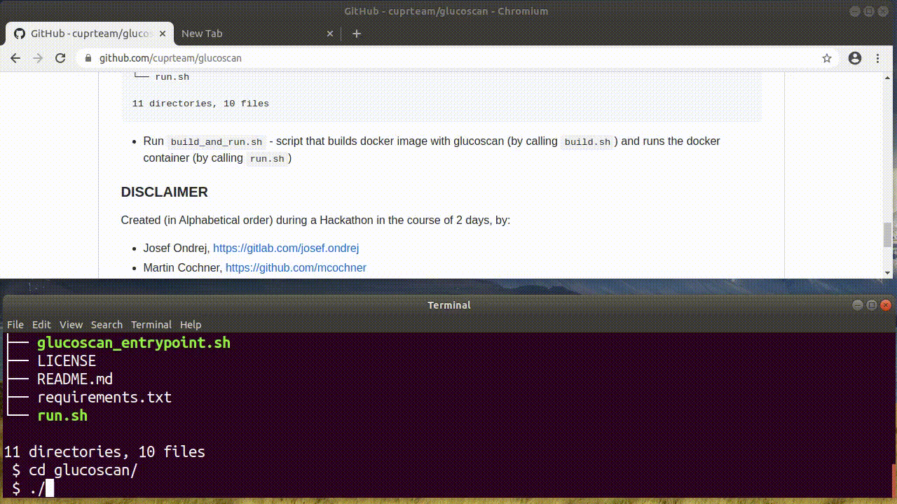

### Glucoscan Overview

### How to run Glucoscan in Docker

 - __Prerequisity__: A linux computer with docker installed
 - Clone the recognizer: `git clone https://github.com/cuprteam/glucoscan`
 - This should result in the following directory structure (printing only the first 2 levels):
```
 $ tree -L 2 --dirsfirst glucoscan/
glucoscan/
├── lcd_digit_recognizer
│   ├── experiments
│   ├── recognition
│   ├── visualization
│   ├── web
│   └── __init__.py
├── recognize_seven_segment
│   ├── detectors
│   ├── experiments
│   ├── hackathon_api
│   ├── resources
│   ├── utils
│   └── __init__.py
├── build_and_run.sh
├── build.sh
├── Dockerfile
├── glucoscan_entrypoint.sh
├── LICENSE
├── README.md
├── requirements.txt
└── run.sh

11 directories, 10 files
```
 - Run `build_and_run.sh` - script that builds docker image with glucoscan (by calling `build.sh`) and runs the docker container (by calling `run.sh`)



### DISCLAIMER
Created (in Alphabetical order) during a Hackathon in the course of 2 days, by:
 - Josef Ondrej, https://gitlab.com/josef.ondrej
 - Martin Cochner, https://github.com/mcochner
 - Miroslav Vodolan, https://github.com/m9ra

See the file LICENSE for the licence conditions.
